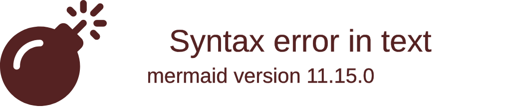

⚠️ **すべての項目を埋める必要はない**。たとえば「感情記録」には「生産性」や「要因」という入力欄があるが特に生産的なことをそもそもしない日だったり要因は「感想・その他」の項目で詳細に記述したから必要ないと判断したりした場合は省略して良い。


### 都度
<details>
<summary>【状況: ストレスを感じたとき】ストレス日記</summary>

~~~
### 基本情報
| 項目 | 内容 |
| --- | :---: |
| 種別 | ストレス日記 |
| 状況 |  |
| ストレスサーモメーター |  |
| 感情 | パイチャート参照 |
| 幸福度 |  |
| 生産性 |  |
| 持続時間 |  |
| ストレス源 |  |
| トリガー |  |
| リアクション |  |
| 身体反応 |  |
| 対処レベル |  |

### 感情（パイチャート）


### 感想・その他
特になし。
~~~

_記録の力 p.144_

#### ストレスサーモメーター
以下のような架空の温度計を見ながら、今のストレスが何点なのか採点します。「過去にも味わったことがないストレス」が 10 点で、「まったく何のイライラも不安もない」なら 0 点です。


#### 幸福度
そのストレスを受けたせいで、気分がどこまで落ち込んだかを 10 点満点で採点します。最低の気分なら 0 点で、最高の気分なら 10 点です。

#### 生産性
そのストレスを受けて、自分の生産性がどう変化したかを 10 点満点で採点します。いかにストレスが強くても、いつもと同じように働いたり日常の雑用をこなしたりすることができていれば 10 点、何も手につかなくなったのなら 0 点です。

#### 持続時間
ストレスを感じた時間の長さを記入します。「10 分間」「午後いっぱい」「1 日中」など。

#### 状況
ストレスを感じた時の環境、場所、原因になった人などを記入します。「鍵をかけずに家をでた」「上司から大量の仕事を指示された」「気温が寒すぎる」など。

#### ストレス源
「上司」「子ども」「ネットニュース」など、あなたにストレスを与えた原因を書きます。

#### 感情
そのストレスに対して、どんな感情を抱いたかを記録します。「怒り」「悲しみ」「イライラ」など、気持ちを正確に表せる言葉を探してください。

#### トリガー
「状況」がストレスを引き起こした理由を書き出します。たとえば、状況が「鍵をかけずに家をでた」なら、トリガーは「昨日、帰宅してソファに鍵を放置してしまった」、状況が「気温が寒すぎる」なら、トリガーは「天気予報を確認せずに家を出た」など。

#### リアクション
ストレスを感じた時に、あなたがどのような感情、または思考を抱いたかを記録します。「なんて俺はドジなんだ！ と思った」「あの上司は部下のことを何も考えていない！」「早く暖かくならないかなぁ……と感じた」など。

#### 身体反応
ストレスを感じた後、体にどんな変化が現れたかを記録します。「頭痛がした」「胃のあたりが重い」「手のひらに汗」のように、簡潔に書き込んでください。

#### 対処レベル
そのストレスをどれだけうまく対処できたかを書きます。「全然ダメ」「怒りが爆発した」「まぁまぁ」ぐらいの表現で、シンプルに書き込んでください。

#### 記入例
| 日時 | ストレス | 幸福度 | 感情 | 生産性 | ストレス源 | 身体反応 | 対処レベル |
| :---: | --- | :---: | :---: | :---: | :---: | :---: | :---: |
| 6/8 8:30 | 通勤ラッシュ | 4 | 朦朧 | 2 | 激混み | 吐き気 | ダメダメ |
| 10:30 | 予定の会議がキャンセル | 6 | 軽い不安 | 7 | 上司 | 胃が重い感じ | OK |
| 6/9 11:20 | 打合せの相手が 30 分遅刻 | 5 | イライラ | 6 | クライアント | 全身が熱い | よくない（コーヒーがぶ飲み） |
| 15:30 | 会社のプリンターが故障 | 3 | 怒り | 3 | 機械 | 頭が熱い | ダメダメ（修理の人に嫌な態度） |
| 17:40 | 予定の納品物が届かない | 5 | イライラと不安 | 6 | 外注先 | 汗ばむ | OK |
| 6/10 8:40 | 車両点検で電車が遅れる | 3 | 怒り | 8 | 電車 | 脈が速い | OK |
| 9:20 | プロジェクトの〆切が前倒しに | 2 | 超不安 | 4 | 上司 | 全身が熱い | ただ慌てる |
| 15:30 | 腰痛がひどい | 2 | 不安と苦しみ | 1 | 腰 | 全身が硬い | 薬が効果なし |

_記録の力_

| 時間 | ストレスレベル | 持続時間 | 状況 | トリガー | リアクション |
| :---: | :---: | :---: | --- | --- | --- |
| 10 時 | 5 | 40 分 | 上司に資料の作り方を注意された | 前にも言われたことを直さなかった | 気分が沈んで首あたりがチクチク痛んだ |
| 13 時 | 3 | 10 分 | 忙しくて昼飯を食べられなかった | 昼前の作業が終わらなかった | 作業の多さを呪った。あと軽い怒り |
| 18 時 | 8 | 午後ずっと | 今週末が締め切りの作業が全然終わらない | 仕事をずっと先延ばしにしてた | 軽いパニック状態で、仕事の多さに激しい怒り |
| 20 時 | 4 | 1 時間 | 忙しいのに友人から長電話が…… | 仕事のイライラと合わさってストレス激増 | 「こいつ空気読まないな」という気持ちがグルグル |
| 22 時 | 2 | 20 分 | 夜のニュースでヒドい事件を見た | 特になし | 「世の中はヒドいことばかり」と思って軽い頭痛 |

_超ストレス解消法_

TODO: データを蓄積したあとの活用法について、それぞれ記録の力、超ストレス解消法に記載されているのでそれをまとめる。
</details>


<details>
<summary>【状況: 怒りを感じたとき】アンガーログ</summary>

```
### 基本情報
| 項目 | 内容 |
| --- | :---: |
| 種別 | アンガーログ |
| 怒りの原因 |  |
| 怒りレベル |  |
| 反応 |  |
| 反応の判断 |  |

### 感想・その他
特になし。
```

_記録の力 p.203_

#### 怒りの原因
あなたを怒らせた人物やイベントを記入します。「会議が長引いた」や「仕事の邪魔された」など、怒りのトリガーを端的に書いてください。

#### 怒りレベル
どれくらい怒りを感じたかを 10 点満点で採点してください。腸が煮えくり返るくらいの怒りなら 10 点、まったくイライラしていないなら 0 点です。

#### 反応
怒りの感情に対して、あなたがどんなリアクションを取ったかを記入します。「怒鳴り散らした」「黙り込んだ」のように、自分が取った行動を記入しましょう。

#### 反応の判断
その怒りと行動が、後から振り返って正しいものだったかを記入します。「部下への失敗に怒りを抱くのは正しいが、人前で怒鳴り散らしたのは間違いだった」など、自分の正当性を考えてみましょう。

#### 記入例
| 日付 | 怒りの原因 | 反応 | 反応の判断 |
| :---: | --- | --- | --- |
| 6/6 | 打ち合わせに遅刻された | 小言をブツブツ | 怒ったのは正しいが、小言が長すぎた |
| 6/6 | 行動しない自分にイライラ | イライラしながらもネットを見る | どちらも正しくない |
| 6/7 | 会社でネットを見てて怒られる | ただむくれる | 怒られたのは当然だし、むくれても意味がなかった |
| 6/7 | 家族の風呂が長い | グッと飲み込む | さすがに 2 時間は入りすぎな気がする |
| 6/8 | 飲み会をドタキャンされた | 激怒の LINE を連発 | 怒ったのは正しいが、相手に悪い印象を与えた |
| 6/9 | 深夜に隣人が大騒ぎ | 壁を叩いた | 正当な怒りだと思う |
| 6/9 | 後輩に話をしてたら、よそ見を始めた | 「おい！」とだけ叫ぶ | 正当な怒りと対応だと思う |
| 6/10 | 上司にバカにされた | 引きつった笑顔で「やめてよ」と指摘 | 悪くない対応 |
| 6/10 | スーパーの列で横入りされた | 咳払い | なんか言ってやればよかった |
| 6/11 | 怒られている子どもを見かけた | とりあえず怒っている両親をにらむ | 怒りは当然だが、もうちょっと何かできた気もする |
| 6/12 | 子どもがうるさい | 怒鳴る | さすがに声を荒げすぎた |
</details>


<details>
<summary>【状況: 身体の痛みを感じたとき】痛みダイアリー</summary>

```
### 基本情報
| 項目 | 内容 |
| --- | :---: |
| 種別 | 痛みダイアリー |
| 痛い場所 |  |
| 痛みレベル |  |
| 状況 |  |
| 原因 |  |
| 対処 |  |

### 感想・その他
特になし。
```

_記録の力 p.159_

#### 痛い場所
痛みが起きた場所を書き込みます。「腰の左下あたり」「後頭部のつむじに近いエリア」「肩甲骨の左側全体」のように細かい場所を書いたほうが効果は高くなりますが、慣れないうちは「頭」や「腰」「ヒザ」などのザックリした表現でも構いません。

#### 痛みレベル
苦痛の大きさを 10 点満点で採点してください。過去にも味わったことがない痛みなら 10 点、少し耐えられなくなってきたくらいが 6 点、まったくの無痛なら 0 点です。

#### 状況
その痛みが起きたときにあなたがしていたこと、または周囲の状況を書き込みます。「お皿を洗っていた」「電車がこないのでイライラしていた」「会社で周囲がケンカしていた」のように、どんな状況で痛みが起きたのかを思い出してみてください。

#### 原因
痛みを引き起こしたトリガーを記入します。「満員電車でイライラ」や「無礼な店員の態度に怒った」といったメンタル系のトリガーでもいいですし、「重いものを持ち上げた」や「運動中に転んだ」のような身体的なトリガーを書いても問題ありません。原因がわからないときは「不明」と書いてください。

#### 対処
あなたが痛みにどんな対策をしたか、そしてその対策にはどれだけの効果があったかを書き込みます。「薬を飲んだらやや楽になった」「軽くストレッチをしたが効果なし」など、対策の内容と結果をセットで記入してください。

#### 記入例
| 日時 | 痛い場所 | 痛みレベル | 状況 | 原因 | 対処 |
| :---: | :---: | :---: | --- | --- | --- |
| 10/11 16:00 | 腰 | 6 | オフィスで朝からずっとデスクワーク | プロジェクトの進捗の遅れでイライラ | ハーブティーを飲んだら少し楽になった気もする |
| 10/12 18:00 | 〃 | 5 | 外回りの日 | 歩きすぎ | 早めにゆっくりお風呂に入ったらすぐ眠れた |
| 10/13 19:00 | 〃 | 4 | 友人と会食 | 痛みを感じるときもあるが、気にならない時間帯が多い | 特に何もせず |
| 10/14 10:30 | 〃 | 3 | 終日、家で過ごす | 一人でいると痛みに意識が向かいがちだが、今日は楽 | お風呂とストレッチ。横ばい |
| 10/15 8:00 | 〃 | 6 | 休日明けの出勤途中 | 電車混みすぎ。少し無理な体勢になった | 駅からタクシー。変化はないが悪化は防げたはず |
| 10/16 11:00 | 〃 | 4 | オフィスでデスクワーク（人まばら） | 上司が出張だと体が少し軽くなる気がする | 特に何もせず |
</details>


<details>
<summary>【状況: 身体に不調があったとき】体調記録</summary>

```
### 基本情報
| 項目 | 内容 |
| --- | :---: |
| 種別 | 体調記録 |
| 不快な場所 |  |
| 不快レベル |  |
| 状況 |  |
| 原因 |  |
| 対処 |  |

### 感想・その他
特になし。
```

_記録の力 p.159_

#### 不快な場所
不快が起きた場所を書き込みます。「腰の左下あたり」「後頭部のつむじに近いエリア」「肩甲骨の左側全体」のように細かい場所を書いたほうが効果は高くなりますが、慣れないうちは「頭」や「腰」「ヒザ」などのザックリした表現でも構いません。

#### 不快レベル
不快の大きさを 10 点満点で採点してください。過去にも味わったことがない不快なら 10 点、少し耐えられなくなってきたくらいが 6 点、まったく不快でないなら 0 点です。

#### 状況
その不快が起きたときにあなたがしていたこと、または周囲の状況を書き込みます。「お皿を洗っていた」「電車がこないのでイライラしていた」「会社で周囲がケンカしていた」のように、どんな状況で不快が起きたのかを思い出してみてください。

#### 原因
不快を引き起こしたトリガーを記入します。「満員電車でイライラ」や「無礼な店員の態度に怒った」といったメンタル系のトリガーでもいいですし、「重いものを持ち上げた」や「運動中に転んだ」のような身体的なトリガーを書いても問題ありません。原因がわからないときは「不明」と書いてください。

#### 対処
あなたが不快にどんな対策をしたか、そしてその対策にはどれだけの効果があったかを書き込みます。「薬を飲んだらやや楽になった」「軽くストレッチをしたが効果なし」など、対策の内容と結果をセットで記入してください。

#### 記入例
| 日時 | 不快な場所 | 不快レベル | 状況 | 原因 | 対処 |
| :---: | :---: | :---: | --- | --- | --- |
| 10/11 16:00 | 腰 | 6 | オフィスで朝からずっとデスクワーク | プロジェクトの進捗の遅れでイライラ | ハーブティーを飲んだら少し楽になった気もする |
| 10/12 18:00 | 〃 | 5 | 外回りの日 | 歩きすぎ | 早めにゆっくりお風呂に入ったらすぐ眠れた |
| 10/13 19:00 | 〃 | 4 | 友人と会食 | 痛みを感じるときもあるが、気にならない時間帯が多い | 特に何もせず |
| 10/14 10:30 | 〃 | 3 | 終日、家で過ごす | 一人でいると痛みに意識が向かいがちだが、今日は楽 | お風呂とストレッチ。横ばい |
| 10/15 8:00 | 〃 | 6 | 休日明けの出勤途中 | 電車混みすぎ。少し無理な体勢になった | 駅からタクシー。変化はないが悪化は防げたはず |
| 10/16 11:00 | 〃 | 4 | オフィスでデスクワーク（人まばら） | 上司が出張だと体が少し軽くなる気がする | 特に何もせず |
</details>


<details>
<summary>【状況: 現在の受容レベルをチェックしたいとき】受容レベル診断テスト</summary>

```
### SA-AAQ
| 項目 | 点数 |
| --- | :---: |
| 質問 1 |  |
| 質問 2 |  |
| 質問 3 |  |
| 質問 4 |  |
| 質問 5 |  |
| 質問 6 |  |
| 質問 7 |  |
| 質問 8 |  |
| **奇数の質問の平均値** | **** |
| **偶数の質問の平均値** | **** |

<details>
<summary>質問</summary>

1. コミュニケーションの不安は、自分にとって価値のある人生を送る妨げになっている
2. 社交不安について考えないように、自分に言い聞かせることがある
3. コミュニケーションの不安をなくすために、人生で大事なものを犠牲にしていることがある
4. 不適切なコミュニケーションをする自分を批判してしまうことがある
5. 人生で大事な決断をする前には、自分の社交不安を減らさなければならない
6. 自分がコミュニケーション不安に対して抱いている「考え方」が良いものなのか悪いものなのかを、よく考えてしまう
7. 自分の社交不安は、自分が行きたい人生を送るジャマにはならない
8. コミュニケーションで不安になっても、自分では認めないことがある
</details>

<details>
<summary>採点方法</summary>

上記の質問に 1 点（まったく当てはまらない）〜 7 点（完全に当てはまる）の範囲で点数をつけていく。

* 奇数の質問の数字を足して平均値を出す
* 偶数の質問の数字を足して平均値を出す
* それぞれの平均が 4 以上の場合は一般的な人よりも症状が深刻だと考えられる
</details>

### 感想・その他
特になし。
```
</details>


<details>
<summary>【状況: コーピング・レパートリーを試したとき】コーピング日記</summary>

```
### 基本情報
| 項目 | 内容 |
| --- | :---: |
| 種別 | コーピング日記 |
| 状況 |  |
| コーピング |  |
| 結果 |  |

### 結果の詳細・感想・その他
特になし。
```

#### 状況
ストレスの内容を記入します。

#### コーピング
実際に試してみたストレス解消テクニックを記入します。

#### 結果
実践したコーピングがストレス解消にどのぐらい効果があったかを 10 点満点で採点してください。

#### 記録例
⚠️ 下記の記入例では結果に具体的な文章を書いているが実際には 10 点満点で採点した値を記入する。具体的な文章は「結果の詳細・感想・その他」に記入する。

| 時間 | 状況 | コーピング | 結果 |
| :---: | --- | --- | --- |
| 10 時 | 明日までの仕事があるのに気がついたら後輩が先に帰っていた | 軽く深呼吸してから、自分のイライラを 20 分ぐらい紙に書き出した | 冷静な気持ちになれて、感情的にならずに後輩に注意のメールを送ることができた！ |
| 18 時 | 10 年前の失敗を友人からイジられまくり、さすがにイライラが大変なことに | 黙ってジッと怒りをこらえ、友人がこちらのイライラに気づいてくれるように仕向けてみた | イライラは収まらないし友人との話は止まるしであまりいいことはなかったなぁ… |
| 22 時 | なんだかわからないがとにかく急に悲しくなって不安にもなった | とりあえず部屋を掃除してアロマテラピーをやってみた | 掃除に集中してるうちに悲しみが消えてた |
</details>


### 毎日
<details>
<summary>【頻度: 1 日 4 回】感情記録</summary>

~~~
### 基本情報
| 項目 | 内容 |
| --- | :---: |
| 種別 | 感情記録 |
| ストレスサーモメーター |  |
| 感情 | パイチャート参照 |
| 気分レベル |  |
| 生産性 |  |
| 要因 |  |

### 感情（パイチャート）


### 感想・その他
特になし。
~~~

_[1 日 4 回ずつ、そのときに自分がどんな感情を抱いていたかを記録すると良い](https://yuchrszk.blogspot.com/2019/07/blog-post_38.html#:~:text=1%E6%97%A54%E5%9B%9E%E3%81%9A%E3%81%A4%E3%80%81%E3%81%9D%E3%81%AE%E6%99%82%E3%81%AB%E8%87%AA%E5%88%86%E3%81%8C%E3%81%A9%E3%82%93%E3%81%AA%E6%84%9F%E6%83%85%E3%82%92%E6%8A%B1%E3%81%84%E3%81%A6%E3%81%84%E3%81%9F%E3%81%8B%E3%82%92%E8%A8%98%E9%8C%B2%E3%81%97%E3%81%A6%E3%81%8F%E3%81%A0%E3%81%95%E3%81%84%E3%81%AD%E3%83%BC)_

#### ストレスサーモメーター
以下のような架空の温度計を見ながら、今のストレスが何点なのか採点します。「過去にも味わったことがないストレス」が 10 点で、「まったく何のイライラも不安もない」なら 0 点です。


#### 幸福度
現在の気分がどれくらいかを 10 点満点で採点します。最低の気分なら 0 点で、最高の気分なら 10 点です。

#### 感情
どんな感情を抱いたかを記録します。「ウキウキ」「スッキリした感じ」「怒り」「悲しみ」「イライラ」など、気持ちを正確に表せる言葉を探してください。より細かな言葉で感情を表現したほうが効果が高まります。

#### 生産性
自分の生産性がどれくらいかを 10 点満点で採点します。いつもと以上に働いたり日常の雑用をこなしたりすることができていれば 10 点、何も手につかなかったなら 0 点です。

#### 要因
その気分になったと考えられる要因について考察して記入します。特に理由が思い浮かばない場合は「不明」と記入します。
</details>


<details>
<summary>【頻度: 1 日 1 回】【自動思考キャッチトレーニング Lv. 1】シンプル・ソート・レコード</summary>

1 日に最低でも 1 回は記入する。

~~~
### 基本情報
| 項目 | 内容 |
| --- | :---: |
| 種別 | シンプル・ソート・レコード |
| 状況 |  |
| 感情 | パイチャート参照 |
| 思考またはイメージ |  |

### 感情（パイチャート）


### 感想・その他
特になし。
~~~

#### 状況
あなたにストレスを与えた人、場所、時間などを書き込みます。「道ばたで友人を見かけたので声をかけたが無視された」「急に知らない人からニラまれた」など。

#### 感情
ストレスを感じた時に、どんな感情を抱いたかを書き込んで、それぞれの割合をパーセントで採点します。「悲しさ 20 %、怒り50 %」「納得いかない気持ち 60 %」「虚無感 100 %」など。

#### 思考またはイメージ
ストレスを感じた時に、どんな思考やイメージが頭に浮かんだかを書き込みます。「自分が何か悪いことをしただろうか……」や「失礼な相手に怒鳴り散らす自分のイメージ」など。

#### 記入例
| 状況 | 感情 | 思考またはイメージ |
| --- | --- | --- |
| 道ばたで友人を見かけたので声をかけたが無視された | 納得いかない気持ち 60 % 切ない感覚 30 % | 「何か悪いことをしたか…」と思った |
| 上司から急に怒られた | ムシャクシャ 100 % | 「あんなやつ上司失格だ」と思い、上司を殴る想像 |
| 飼っていたペットが病気に | 悲しみ 50 % 焦り 50 % | ペットが弱っていくイメージ止まらない |
| 急に知らない人からニラまれた | 虚無感 100 % | 失礼な相手に怒鳴り散らす自分のイメージ |
</details>


<details>
<summary>【頻度: 1 日 1 回】【自動思考キャッチトレーニング Lv. 2】ケース・フォーミュレーション</summary>

1 日に最低でも 1 回は記入する。

~~~
### 基本情報
| 項目 | 内容 |
| --- | :---: |
| 種別 | ケース・フォーミュレーション |
| 状況 |  |
| 感情 | パイチャート参照 |
| 思考 |  |
| 行動 |  |
| 身体感覚 |  |

### 感情（パイチャート）


### 感想・その他
特になし。
~~~

#### 状況
あなたにストレスを与えた人、場所、時間などを書き込みます。「道ばたで友人を見かけたので声をかけたが無視された」「急に知らない人からニラまれた」など。

#### 感情
ストレスを感じた時に、どんな感情を抱いたかを書き込んで、それぞれの割合をパーセントで採点します。「悲しさ 20 %、怒り50 %」「納得いかない気持ち 60 %」「虚無感 100 %」など。

#### 思考
ストレスを感じた時に、どんな思考やイメージが頭に浮かんだかを書き込みます。「自分が何か悪いことをしただろうか……」や「失礼な相手に怒鳴り散らす自分のイメージ」など。

#### 行動
ストレスに対してあなたがどんな行動を取ったかを書き込みます。「なにもせずじっと耐えた」「深呼吸をした」「壁を殴った」など。

#### 身体感覚
ストレスを感じた時に、あなたの体に起きた変化を書き込みます。「呼吸が浅くなった」「頭が痛くなった」「胸が圧迫された感じ」など。

#### 記入例
⚠️ 本当は「感情」は割合を書いたほうが良いはず……。

| 状況 | 感情 | 思考 | 行動 | 身体感覚 |
| --- | --- | --- | --- | --- |
| 仕事で取引先を怒らせてしまった | 悲しみ<br>イライラ<br>不安<br>焦り | 上司は僕を無能だと思うだろうな… | 上司の目を避けて仕事を進めるようになった | やる気が減少<br>無気力でボーっとした感じ |
</details>


<details>
<summary>【頻度: 1 日 1 回】【自動思考キャッチトレーニング Lv. 3】セブンコラム（表形式）</summary>

記載は特にないが、ケース・フォーミュレーションが 1 日最低でも 1 回は記録することが推奨されていることを考えるとこれも 1 日 1 回くらいのペースで行ったほうが良いだろう。

~~~
### 基本情報
| 項目 | 内容 |
| --- | :---: |
| 種別 | セブンコラム |
| 状況 |  |
| 感情 | パイチャート参照 |
| 思考 |  |
| 根拠 |  |
| 反証 |  |
| バランス思考 |  |
| いまの気分 | パイチャート参照 |

### 感情（パイチャート）


### いまの気分（パイチャート）


### 感想・その他
特になし。
~~~

#### 状況
あなたにストレスを与えた人、場所、時間などを書き込みます。「道ばたで友人を見かけたので声をかけたが無視された」「急に知らない人からニラまれた」など。

#### 感情
ストレスを感じた時に、どんな感情を抱いたかを書き込んで、それぞれの割合をパーセントで採点します。「悲しさ 20 %、怒り50 %」「納得いかない気持ち 60 %」「虚無感 100 %」など。

#### 思考
ストレスを感じた時に、どんな思考やイメージが頭に浮かんだかを書き込みます。「自分が何か悪いことをしただろうか……」や「失礼な相手に怒鳴り散らす自分のイメージ」など。

#### 根拠
あなたの頭に浮かんだ思考やイメージが「事実」にもとづいているかを考えて、その答えを書きます。思い込みではなく、あくまで客観的な「事実」だけを書くように注意してください。「プレゼンに失敗したのは、間違いなく自分の準備不足だった」や「自分が悪いと思ったが、考えてみたら根拠はなかった」「あの人が自分を嫌っている可能性はあるが、どこまで真実かはわからない」など。

#### 反証
あなたの頭に浮かんだ思考やイメージを矛盾する「事実」を書き出します。「いつも失敗していると思ったが、先日のプレゼンは成功だった」や「あの人に嫌われていると思ったが、このあいだは親しい感じで会話をした」など。

#### バランス思考
自動思考よりも、より事実にもとづく新たな考えを書いてみましょう。「上司に怒られたが、過去には何度かほめられたこともある。自分のことを嫌っていると思ったのは正確ではなく、たんにその時に上司の虫の居所が悪かっただけかもしれない」など。

#### いまの気分
バランス思考を書き込んだ結果、気分がどのように変化したかをパーセントで書き込みます。「イライラが 40 % 減った」や「不安が 70 % 改善」など。

#### 記入例
⚠️ 本当は「感情」は割合を書いたほうが良いはず……。

| 項目 | 内容 |
| --- | --- |
| 状況 | 上司からプレゼンの資料を直すように言われたが、前に言われたことと全然話が違っている。しかも明日までに急に修正を指示されてしまい、本来の作業にほとんど手を付けられない。 |
| 感情 | 怒り、焦り、徒労感、イライラ |
| 思考 | このあいだもまったく違うことを言ってたし、なんなんだあいつ！ どうせ部下のことなんか何も考えてないんだろう。そういえば、このあいだは俺の企画をさも自分が考えたように言ってたな…… |
| 根拠 | 他の部署でも働いたことがあるが、いまの上司はあきらかに前の上司よりはミスが多い。ただし、部下のことを何も考えていないかどうかはよくわからない。 |
| 反証 | 部下を気にかけないと思ったが、積極的に飲みに誘ったりしてコミュニケーションを取ろうとしているふしはある。ミスは多いが、仕事に成功したことも少なくない。 |
| バランス思考 | 「いまの部下を気にかけない」という思考に客観的な根拠はない。コミュニケーションを取ろうとして誘いをかけてくる姿を見れば、たんに部下との付き合いに困っているだけだとも解釈できる。今回、急な資料の修正を指示してきたのも、仕事に熱心なせいだとも言えなくはない。いまの時点ではどちらとも判断がつかないので、とりあえず目の前の作業予定をリスケジュールして取り組むか、上司に文句を言うかのどちらかにするしかないだろう。 |
| いまの気分 | 怒りが 30 % 減った、焦りは変わらない、イライラは 20 % 減った |
</details>


<details>
<summary>【頻度: 1 日 1 回】【自動思考キャッチトレーニング Lv. 3】セブンコラム（箇条書き形式）</summary>

~~~
### 基本情報
| 項目 | 内容 |
| --- | :---: |
| 種別 | セブンコラム |

### 状況
* 

### 感情（パイチャート）


### 思考
* 

### 根拠
* 

### 反証
* 

### バランス思考
* 

### いまの気分（パイチャート）


### 感想・その他
特になし。
~~~

記述方法に関しては表形式のほうを参照すること。
</details>


### 数週間毎（1 日、15 日）
<details>
<summary>【頻度: 2 〜 4 週間に 1 回】ストレス・シンプトム・スケール</summary>

2 〜 4 週間おきに採点する。

```
### ストレス・シンプトム・スケール
| ストレス症状 | 点数 |
| --- | :---: |
| 疲労感の増加 |  |
| 心臓のドキドキ感 |  |
| 脈拍の増加 |  |
| 汗の量が増えた |  |
| 呼吸スピードの増加 |  |
| 首、肩、腰の痛み |  |
| アゴのこわばり |  |
| 肌の赤み・皮膚の発疹 |  |
| 頭痛 |  |
| 手足が冷たい |  |
| 胸が締め付けられる感覚 |  |
| 吐き気 |  |
| 下痢または便秘 |  |
| 胃の不快感 |  |
| 爪を噛む |  |
| 顔や手足のけいれん |  |
| ドライマウス・呼吸困難 |  |
| 風邪を引く回数の増加 |  |
| イキイキした感覚の低下 |  |
| 食べ過ぎ |  |
| 希望がないような感覚 |  |
| 酒の飲み過ぎ |  |
| タバコの吸いすぎ |  |
| お金のムダ使い |  |
| 市販薬の使いすぎ |  |
| ガッカリした気分 |  |
| 緊張感・不安感の増加 |  |
| イライラ感の増加 |  |
| くよくよした考え |  |
| じれったい気持ち |  |
| 落ち込んだ感覚 |  |
| 性的関心の減少 |  |
| 怒りの増加 |  |
| よく眠れない |  |
| もの忘れ |  |
| 嫌な記憶を思い出す |  |
| 落ち着かない感覚 |  |
| 集中できない |  |
| 急に泣いてしまう |  |
| 仕事を休みがちになる |  |
| **合計点** | **** |

<details>
<summary>採点方法</summary>

過去 2 週間のあいだに、リストのような症状がどれだけ起きたかを思い出して採点する。採点の基準は次の 4 段階。

| 指標 | 点数 |
| --- | :---: |
| まったくない | 0 |
| 時々 | 1 |
| しばしば | 2 |
| とても多い | 3 |

すべての点数を合計し、以下の基準で判断する。

| 点数範囲 | 結果 |
| :---: | --- |
|  0 〜 19 | 平均より下のストレス |
| 20 〜 39 | 平均的なストレス |
| 40 〜 49 | やや平均より上のストレス |
| 50 以上 | 危険なレベル |
</details>

### 感想・その他
特になし。
```
</details>


### 毎月（1 日）
<details>
<summary>【頻度: 月 1 回】PSS4</summary>

月に 1 度行う。

```
### PSS4
| 項目 | 点数 |
| --- | :---: |
| 質問 1 |  |
| 質問 2 |  |
| 質問 3 |  |
| 質問 4 |  |
| **合計点** | **** |

<details>
<summary>質問</summary>

1. この 1 ヶ月で、人生の大きな問題をコントロールすることができないと、どれぐらい感じましたか？
2. この 1 ヶ月で、個人的な問題をうまく処理する能力があると、どれぐらい感じましたか？
3. この 1 ヶ月で、人生がうまく進んでいるなあとどれぐらい感じましたか？
4. この 1 ヶ月で、困難が山積みになって乗り越えるのが無理だと、どれぐらい感じましたか？
</details>

<details>
<summary>採点方法</summary>

下記のスコアに従ってすべての点数を合計する。合計点が 16 点に近いほどストレス度は高いと考えられる。

#### 質問 1 & 4
| 指標 | 点数 |
| --- | :---: |
| 一度もない | 0 |
| ほとんどない | 1 |
| 時々ある | 2 |
| よくある | 3 |
| とてもよくある | 4 |

#### 質問 2 & 3
| 指標 | 点数 |
| --- | :---: |
| 一度もない | 4 |
| ほとんどない | 3 |
| 時々ある | 2 |
| よくある | 1 |
| とてもよくある | 0 |
</details>

### 感想・その他
特になし。
```
</details>


### 参照
<details>
<summary>【状況: ストレスを感じたとき】<b>コーピング・レパートリー</b></summary>

### オリジナル
| トリガー | アクション | コスパ | 手軽さ | 即効性 | 効果の高さ | 持続時間 | 合計スコア |
| --- | --- | :---: | :---: | :---: | :---: | :---: | :---: |
| お腹が空いてイライラしたら | ナッツやバナナなどの軽食を摂る | 9 | 9 |  |  |  |  |  |
| ムカつく出来事が起きたら | アンガーログや筆記開示でぶちまける | 10 | 4 |  |  |  |  |  |
| 気分が落ち込んでいたら | テンションが上がる音楽を聴く | 10 | 5 |  |  |  |  |  |
| 現状のストレス解消法に飽きたら | コーピングを追加する | 10 | 7 |  |  |  |  |  |
| ムカつく出来事が起きたら | 「コーピング・レパートリーを使うチャンスだ！」と思う | 10 | 10 |  |  |  |  |  |
| 不安に苛まれたら | コーピング・レパートリーを眺める | 10 | 8 |  |  |  |  |  |
| 楽しいことがなくて絶望したら | YouTube を観る | 10 | 5 |  |  |  |  |  |
| 楽しいことがなくて絶望したら | 好きな YouTuber や実況者の新着動画を Google で検索する | 10 | 10 |  |  |  |  |  |
| 楽しいことがなくて絶望したら | アニメを観る | 9 | 5 |  |  |  |  |  |
| 自分に自信がなくなったら | 鏡の前で変顔をする | 10 | 8 |  |  |  |  |  |
| ごはんを食べ終わったら | サフランを飲む | 8 | 5 |  |  |  |  |  |
| 焦りを感じたら | 読書をする | 9 | 8 |  |  |  |  |  |
| 作業が煮詰まってイライラしたら | 貧乏ゆすりをする | 10 | 10 |  |  |  |  |  |
| ストレスで何か食べたい衝動に駆られたら | ガムを噛む | 7 | 9 |  |  |  |  |  |
| そういう気分になったら | セルフプレジャーをする | 10 | 6 |  |  |  |  |  |
| そういう気分になったら | 真ん中の足を揉む | 10 | 10 |  |  |  |  |  |
| 物音にイライラしたら | 音を気にせず思いっきりワークアウトをする | 8 | 6 |  |  |  |  |  |
| 焦りを感じたら | ラベンダーの香りを嗅ぐ | 10 | 10 |  |  |  |  |  |
| 不安に苛まれたら | 廊下をウロウロする | 10 | 9 |  |  |  |  |  |
| 作業が煮詰まってイライラしたら | 水を飲む | 10 | 9 |  |  |  |  |  |
| 眠くてボーっとしたら | 昼寝をする | 8 | 7 |  |  |  |  |  |
| 作業が煮詰まってイライラしたら | ハンドマッサージをする | 10 | 10 |  |  |  |  |  |
| 眠くてボーっとしたら | とりあえず横になる | 10 | 8 |  |  |  |  |  |
| 作業が煮詰まってイライラしたら | 窓を開けてボーっと外を眺める | 10 | 9 |  |  |  |  |  |
| 嫌なことがあったら | 頭の中で Cambly の先生と会話をする | 10 | 10 |  |  |  |  |  |
| 作業が煮詰まってイライラしたら | シャワーを浴びる | 7 | 5 |  |  |  |  |  |
| タイプミスが増えてイライラしたら | 爪を切る | 10 | 8 |  |  |  |  |  |
| 落ち込むことがあったら | 感動的な泣ける作品を観る |
| 将来のことやこれからのことで不安に苛まれたら | マインドフルに過ごす・瞑想をする |
| 自分を責めてしまったら | ぬいぐるみを抱く・誰もいないところで自分の身体を触る |
| 嫌なことや悲しいことやムカつくことなどがあったら | 日記のネタが出来てラッキーと思う |

#### アクション
ストレスを解消するための具体的な行動を記入します。

#### トリガー
どのようなストレスに有効なのかを記入します。

#### コスパ
その行動を行った結果の長期的なコスパを 10 点満点で記入します。

| 点数が高い | ↔ | 点数が低い |
| --- | :---: | --- |
| 実行するのにお金がかからない | ↔ | 実行するのにお金がかかる |
| 実行してもノーリスク | ↔ | 実行すると失うものがある |
| 実行すると健康になる | ↔ | 実行すると健康を害する |
| 実行するとポジティブになる | ↔ | 実行するとネガティブな影響が出る |
| 実行してもトラブルにならない | ↔ | 実行するとトラブルになる可能性がある |

#### 手軽さ
その行動がどれだけ実行に移しやすいかを 10 点満点で記入します。

| 点数が高い | ↔ | 点数が低い |
| --- | :---: | --- |
| 何も考えずにとりあえず実行できる | ↔ | 実行するのがめんどくさいなあと感じてしまう |
| すぐに実践できて速攻で完了する | ↔ | 実行するのに時間がかかる |
| 実行するのに準備がいらない | ↔ | 実行にあたって他にしなければいけないことがある（YouTube の視聴にはネットワーク制限の解除が必要） |
| 無制限で何度でもできる | ↔ | 実行回数が限られていたり時間帯が決まっている（シャワーを浴びたりサフランを飲んだりするのは 1 日に何回もできないしある程度時間帯が決まっている） |
| 消耗品の場合はそれを手に入れるのが容易である | ↔ | 手に入れるのが難しい |

#### 即効性
その行動を取ったあとどれくらいすぐにストレス解消の効果が現れるのかを 10 点満点で記入します。

⚠️ これを記入するには実際に直面したストレスに対してその行動を取った結果どのくらい効果があったのかを振り返る必要があります。

#### 効果の高さ
その行動を実践するとストレス解消にどのくらい効果があるのかを 10 点満点で記入します。科学的なエビデンスに裏打ちされた客観的な数値ではなく、実際に自分が実践してみてどう感じたか主観的な数値で記入してください。

⚠️ これを記入するには実際に直面したストレスに対してその行動を取った結果どのくらい効果があったのかを振り返る必要があります。

#### 持続時間
その行動を取ったあとのストレス解消効果がどれくらい持続するのかを 10 点満点で記入します。

⚠️ これを記入するには実際に直面したストレスに対してその行動を取った結果どのくらい効果があったのかを振り返る必要があります。

#### 合計スコア
「コスパ」「手軽さ」「即効性」「効果の高さ」「持続時間」の合計得点を記入します。

_参考: 『[超ストレス解消法 イライラが一瞬で消える100の科学的メソッド](https://www.amazon.co.jp/dp/4865371265)』筆者によるコーピング・レパートリーの例 Loc 2799_

### 備考
* 「ストレスクエスト」という RPG をプレイしているような感覚で行う
    * コーピング・レパートリーはアイテムリスト
    * イライラや不安などのストレス源はモンスター（強いストレスはボスモンスター）
    * ストレス（モンスター）とのエンカウントは嫌なことではなく貴重な経験値を稼いだりコーピング・レパートリー（アイテム）を使ったりするチャンス
    * ストレス（モンスター）をやっつければやっつけるほど経験値が貯まりストレスに強くなる
    * 強いストレス（ボスモンスター）に対しては強力なコーピング・レパートリー（アイテム）を使う
* 100 種類以上のアイテムがあると安心
    * 「YouTube を観る」や「シャワーを浴びる」などすぐにできないものも含まれているので 100 種類よりも多く用意しておくとより安心
* 冒険の書（コーピング日記）をつけてどのモンスターに「こうかは　ばつぐんだ！」になるのかをメモする
    * 同じアイテムでもモンスターによっては「こうかは　いまひとつ　のようだ……」になる可能性もある
* ラストエリクサー（コスパの悪いコーピング）の使用はなるべく避ける
</details>


<details>
<summary>【状況: 落ち込むことがあったとき】<b>感動的な泣ける作品一覧</b></summary>

* [FINAL FANTASY X](https://www.youtube.com/watch?v=YvSOr3NPpTA)
* 推しの子 (特に [シーズン 1 エピソード 1](https://www.amazon.co.jp/gp/video/detail/0Q91K7WKVN329Z9YX8OEU8GHC3/ref=atv_dp_btf_el_prime_sd_tv_resume_t1BTAAAAAA0wr0?autoplay=1&t=0))
* [Yesterday Once More](https://music.youtube.com/watch?v=Aa9YmR8SdeA)
* 国税局に財産を差し押さえられて人生がどうでもよくなり包丁を取り出しつかまる想像（2024 年 12 月 7 日）
* Detroit: Become Human (カーラたちが助かるエンディングやアメリカ軍に囲まれマーカスが歌うエンディング)
</details>


<details>
<summary>【状況: 人生においてなにかコントロールできないことや許せないこと、モヤモヤしたことがあったとき】<b>受容の精神を鍛えるチャンス</b></summary>

* 何十日、何百日と毎日欠かさず続けていた日常の習慣が途切れてしまうとき
* レッスン前の短い時間でやるべきことが中途半端に中断されてしまうとき
* オンラインレッスンや睡眠記録など、日記に書くことはあるけど睡眠を優先するために記録ができなかったとき
* 睡眠を優先するために日記のチェックがついていないタスクがたくさんあったとき
* 他のこと（仕事や他のプライベートのこと）が忙しくて日常タスクをこなせなかったとき
</details>


<details>
<summary>【状況: 感情の種類を分析するとき】ネガティブ感情ラベリング</summary>

* 感情を明確にせずに『イヤだ』や『不快』などの大ざっぱな解釈をする人ほどストレスに弱い
* メンタルが強い人たちは、だいたい以下の「7 つのネガティブ感情ワード」を使って自分の感情を整理する傾向がある
* ストレス日記などを記録する際の『感情』の項目に活用しよう

### 7 つのネガティブ感情ワード
* 悲しみ
* 不安
* 怒り
* イライラ
* 恥
* 嫌悪
* 罪悪感

### オリジナル
* 焦燥感
* 憂鬱
</details>


<details>
<summary>【頻度: 1 日 1 回】<b>アクセプタンス・ワードセラピー</b></summary>

1 日に 1 回は「受容の精神」について述べた言葉や書物に触れる。

| 名言 | 作者 |
| --- | --- |
| 「ゆく河の流れは絶えずして、しかも、もとの水にあらず」 | 方丈記 |
| 「折節（おりふし）の移り変るこそ、ものごとにあはれなれ」 | 徒然草 |
| 「変えることのできるものについて、それを変えるだけの勇気をわれらに与えたまえ。変えることのできないものについては、それを受け入れられる冷静さを与えたまえ。そして、変えることのできるものと、変えることのできないものとを、見分ける知恵を与えたまえ。」 | ラインホルド・ニーバー |
| 「しがみつくことが私たちを強くすると考える者もいるが時には手放すことが私たちを強くするのだ」 | ヘルマン・ヘッセ |
| 「手放すことは相手に愛を伝える手段のひとつである」 | 作者不明 |
| 「わたしたちは、先に死んだ者たちのことを決して忘れたがらない。しかし、心に留めておいてほしい。忘却は世界の終わりではない。新しい人生の始まりなのだ」 | 作者不明 |
| 「誰かへの怒りにこだわることは、その嫌いな相手が、あなたの頭に住み着く権利を無料であたえたのと同じだ」 | アン・ランダース |
| 「わたしたちが本当に練習すべきことはひとつだけ。お互いの存在を手放すことだ。しがみつくことは誰にでもできる。そんなことは学ばなくてもいい」 | リルケ |
| 「ひと呼吸ごとに受容と解放のチャンスがおとずれる。愛情を受け入れ、痛みを解放する」 | ブレンダ・マッキンタイヤ |
| 「ときどき、自分がしがみついているものに本当の価値があるのか確かめ、手放さねばならない」 | 作者不明 |
| 「わたしたちは、計画した人生をあきらめる意志を持たねばならない。未来に待ち受ける人生を受け入れるために」 | ジョセフ・キャンベル |
| 「老子は『自分を手放すと、自分になれる』とおっしゃいました。わたしは、自分の持ち物を手放したとき、必要なものが手に入りました。もがくのを止めたときに理想の仕事やパートナーが見つかったことは？ これが手放すことのパラドックスです。達成するために手放すのです」 | メアリー・マニン・モリッシー |
| 「自分が何者であるかにこだわらなければ、自分になれるだろう」 | 老子 |
</details>

[`🖋️ このテンプレートを更新`](https://github.com/noraworld/diary-templates/edit/main/.github/ISSUE_TEMPLATE/mood.md)
